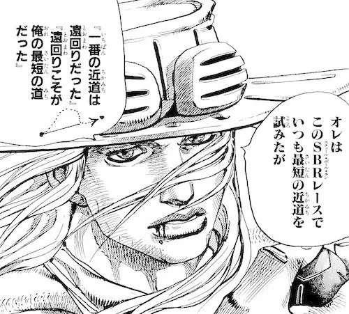

<!--
theme: gaia
class:
 - invert
headingDivider: 2
paginate: true
-->

<!--
_class:
 - lead
 - invert
-->

# 卒業式祝辞

福岡主任講師 大杉太郎

# 明日コードを書け！

<!--
_class:
 - lead
 - invert
-->

## What?

- コードは書かないと忘れる．
- プロダクトをつくる流れを忘れる．
- 人生を楽しめなくなる．

## Why?

ChatGPT があるから書かなくてよくね？

**否！！コードを書けない人間には AI を扱えないッ！！**

- やることは変わらない．
- スピードとやり方が変わる．

## AI は鉄砲に似ている

武田勝頼は長篠の戦いで．．．

- ✅ 信長に敗れた
- ❎ 鉄砲に敗れた

## AI は鉄砲に似ている

**強力なハードウェアを「人間がどう扱うか」が大事！**

- 農民に鉄砲を持たせても勝てない．
- 信長は鉄砲がなくても多分勝ってた．

## AI を扱うには「コードを書け！」

- コードを書けるやつが AI を扱える．
- コードを書けるやつのスピードが上がる．

## 「自分でコードを書く遠回り」を恐れるな！

<!--
_class:
 - lead
 - invert
-->

# 明日コードを書け

<!--
_class:
 - lead
 - invert
-->

### 🥃
